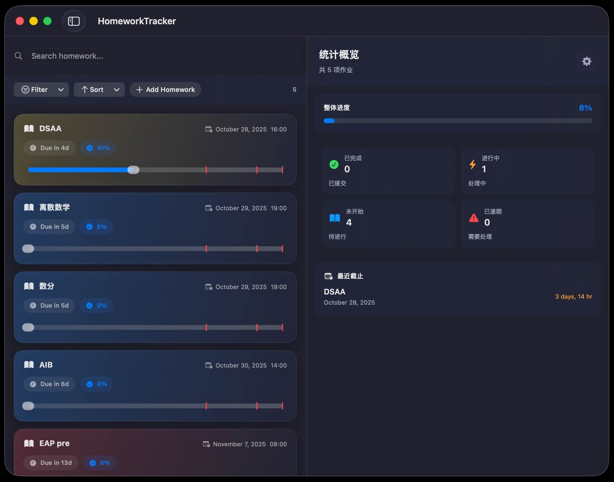

# Homework Tracker

Tracks your homework and deadlines easily.

> [!IMPORTANT]
> Homework Tracker uses tons of ~~rubbish~~ `.glassEffect()`, thus **MacOS26** is required.

## Feature

- Add homework

- **MileStones**
    - Add important progress milestones. (default: finished, checked, submitted)
    - Drag your progress! (0-100)

- Urgency Level
    - Compute urgency based on `progress`, `dueDate`, `Difficulty`.
    - function:  $(100-\text{progress})/\text{time to dueDate}} \cdot 1.5^{\text{Difficulty}$
        - // TODO: Add DIY function
        
- Auto Deletion
    - Delete completed ddls after 7(could be changed) days after ddl.
    
- Difficulty
    - Could be set to 1~6.
    - If you DO need larger or smaller values, ~~input `FUCK [value]`~~ (Note that difficulty level is only `Int8`)
    
## TODO List

- Auto Adding. (e.g. add DSAA homework every Tuesday 16:00)
- DIY urgency function
- Better Settings Panel
- Find something to put in the left pannel
- Make the right panel draggable
- Multi-Language Support

> [!Tip]
> PRs and Issues are Welcomed!
